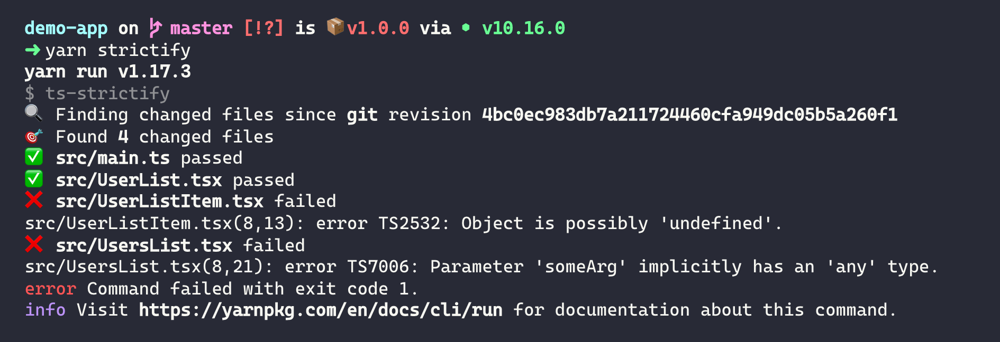

# ts-strictify

> Runs [TypeScript](hhttp://www.typescriptlang.org/) in strict mode on your changed files.



## Background

TBD

## How it works

When you start working on a new feature or fixing a bug, you will modify the code base in one way or another. `ts-strictify` will take a look at these changes - and only these changes (!) and will complain, if the files you have touched are not strict compliant.

That is different than TypeScript works. You could check a single file against the compiler, but the compiler would also look up the imports and the imports of the imports. Not exactly what you want, when you are looking for incrementally update path.

Head over to https://cschroeter.net/moving-to-strict-typescript/ for more insights.

## Install

With `yarn`:

```shellsession
yarn add --dev ts-strictify
```

With `npm`:

```shellsession
npm install --save-dev ts-strictify
```

## Usage

With `yarn`:

```shellsession
yarn ts-strictify
```

You can also disable a compiler flag, for example you want to disable `strictNullChecks`

```shellsession
yarn ts-strictify --strictNullChecks false
```

You can find a list of all available options [`here`](#options).

With [`npx`](https://npm.im/npx):

```shellsession
npx ts-strictify
```

With `npm`:

1. Add `"ts-strictify": "ts-strictify"` to the scripts section of `package.json`.
2. `npm run ts-strictify`

## Pre-Commit Hook

You can run `ts-strictify` as a pre-commit hook using [`husky`](https://github.com/typicode/husky).

```shellstream
yarn add --dev husky
```

In `package.json`, add:

```
"husky": {
  "hooks": {
    "pre-commit": "ts-strictify"
  }
}
```

## Options

```bash
Options:
  --help                          Show help                       [boolean]
  --version                       Show version number             [boolean]
  --noImplicitAny                                 [boolean] [default: true]
  --noImplicitThis                                [boolean] [default: true]
  --alwaysStrict                                  [boolean] [default: true]
  --strictBindCallApply                           [boolean] [default: true]
  --strictNullChecks                              [boolean] [default: true]
  --strictFunctionTypes                           [boolean] [default: true]
  --strictPropertyInitialization                  [boolean] [default: true]
  --noEmit                                        [boolean] [default: true]
  --targetBranch                               [string] [default: "master"]
  --commitedFiles                                 [boolean] [default: true]
  --stagedFiles                                   [boolean] [default: true]
  --modifiedFiles                                 [boolean] [default: true]
  --untrackedFiles                                [boolean] [default: true]
  --createdFiles                                  [boolean] [default: true]
```

## Supported SCM

- Git
